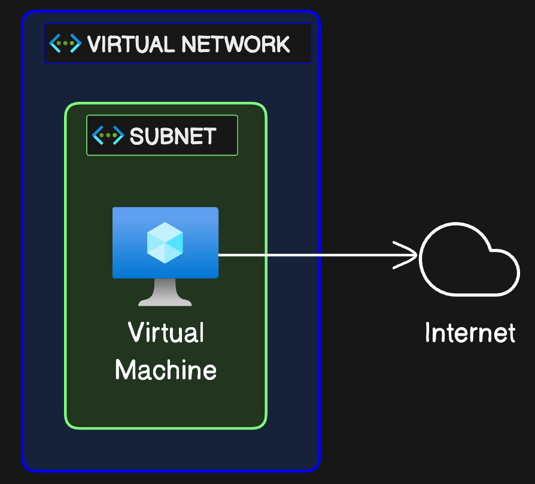

# Single VNet

This example deploys a single VNet with a single subnet and one VM. The VM doesn't have a public IP, so outbound SNAT is dynamic and handled by the underlying fabric. The outbound IP can change at any time.

