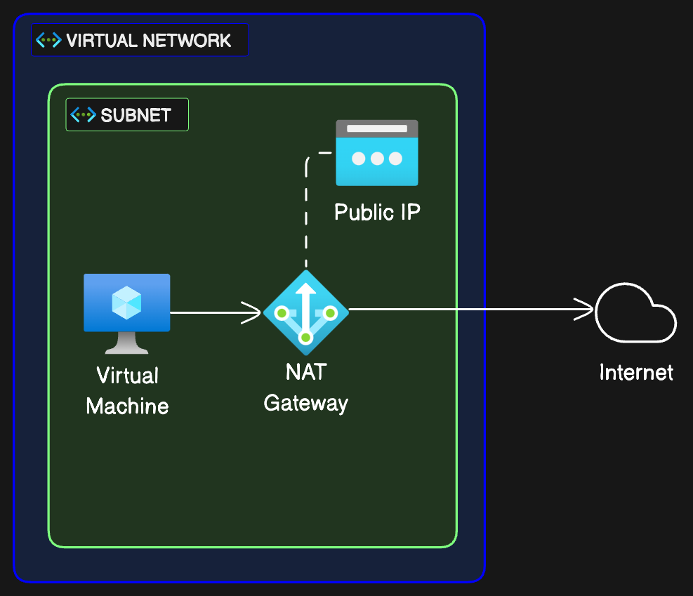

# Single VNet with NAT Gateway

This example deploys a single VNet with a single subnet and one VM. It also deploys a NAT gateway and a Public IP address attached to the gateway. The subnet is configured to use this gateway, so outbound SNAT is static and goes through the gateway. Return traffic for existing flows is allowed back through, but the NAT gateway cannot do DNAT inbound on new flows.

